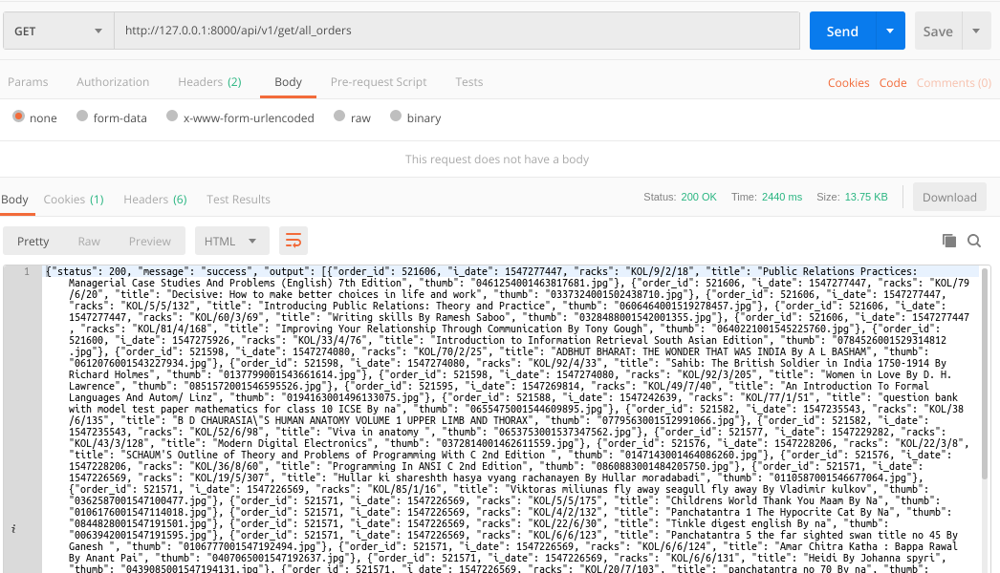

### README- all_orders

#### Description-
- **Fetches order_no, i_date, rack_no, book title & book thumb by joining orders, order_books & books table.**
- Here in the **Orders table, status must be 0 (implies processing) & if payusing is "cod" then value of cod_offer_interested must be 2 simultaneously.**
- **Here the recent orders are showed first.**
- Data is returned in JSON.
- GET Method is used.

#### API Url-
- http://103.217.220.149:80/api/v1/get/all_orders

#### Test Data-
- No data to pass

#### Output-
- Postman Output 

#### References-	
- *ORDER STATUS :: 
   0- processing, 1- complete, 2- cancel, 3- refund, 4- fail, 5- shipping, 6- shippment booked, 7- ready to ship*

#### AUTHOR-
- **coded by AAYUSH GADIA** 
- **contact info: gadia.aayush@gmail.com**
- **written on: 25th Feb' 2019**
- **updated on: 27th Feb' 2019** (common models integrated)
