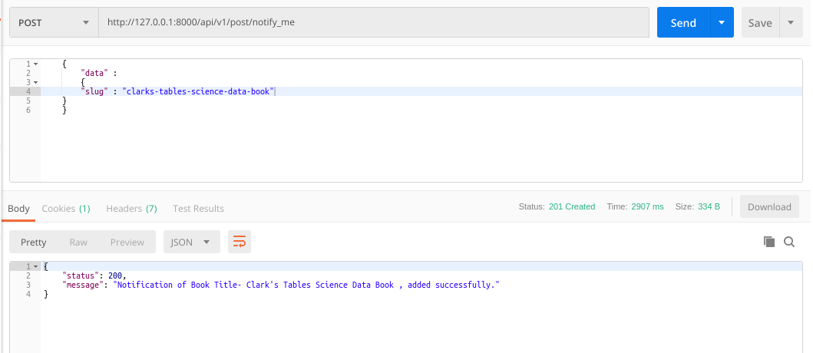
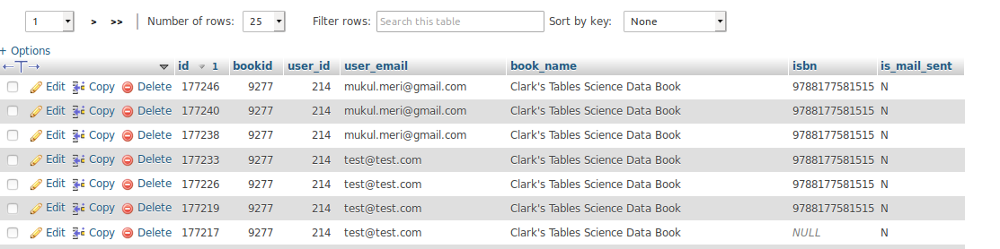

### README- book_notify

#### Description-
- This API inserts user's email, user's id & the book details- title & isbn to *booknotify* table.
- Assuming that- 
  If a user is logged in then the email address section is auto-fetched & the user just has to submit.
- **The API will work only when the User is Logged in as we are passing token in Headers.**
- Data is passed to the API in JSON by frontend application.
- POST Method used.

#### API Url-
- http://103.217.220.149:80/api/v1/post/notify_me
- Headers: **KEY**- *Authorization*, **VALUE**- *Token da0a3bed7fd86b67f0cddd7f49248813a14f00f4*
- The token belonged to **mukul.meri@gmail.com** login.

#### Test Data-
	{
		"data" :
		{
		"slug" : "clarks-tables-science-data-book"
	}
	}

#### Output-
- Postman Output *(when successfully added)*

- Postman Output *(when error)*

- MySQL Output

#### Improvements-
- **executed the following queries in booknotify table.**
  - ALTER TABLE booknotify MODIFY isbn VARCHAR(255);

- **execute all the queries in MyPustak Live database.** 

#### AUTHOR-
- **coded by AAYUSH GADIA** 
- **contact info: gadia.aayush@gmail.com**
- **written on: 19th Feb' 2019**
- **updated on: 28th Feb' 2019** (converted it to token based & common models integrated)
