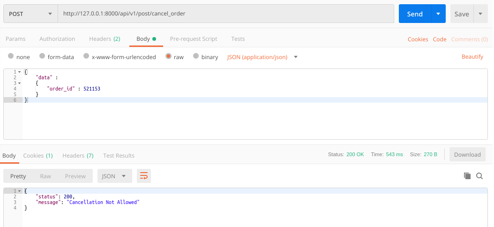

### README- cancel_order

#### Description-
- This API cancels the order & changes the value of following attributes- *status, qty, is_soldout/ is_out_of_stack  & u_date* present in *orders, bookinventory & books table.*
- POST Method used.
- User token is passed to the API in headers.
- **The API will work only when the User is Logged in as we are passing token in Headers.**
- **Assumed-**
   - for example, in an order more than 1 qty of books are ordered for 1 particular book_id then for each book separate row is inserted in the order_books table.

#### API Url-
- http://103.217.220.149:80/api/v1/post/cancel_order
- Headers: **KEY**- *Authorization*, **VALUE**- *Token da0a3bed7fd86b67f0cddd7f49248813a14f00f4*
- The token belonged to **mukul.meri@gmail.com** login.

#### Test Data-
	{
		"data" :
		{
			"order_id" : 521153
		}
	}

#### Output-
- Postman Output *(when cancellation requested)*

- Postman Output *(when cancellation requested on order whose status != 0)*

#### Improvements-
- The API responds slowly when cancelling more than 30 different types of books present in an order, it takes around 5-6 secs.

#### AUTHOR-
- **coded by AAYUSH GADIA** 
- **contact info: gadia.aayush@gmail.com**
- **written on: 28th Feb' 2019**
