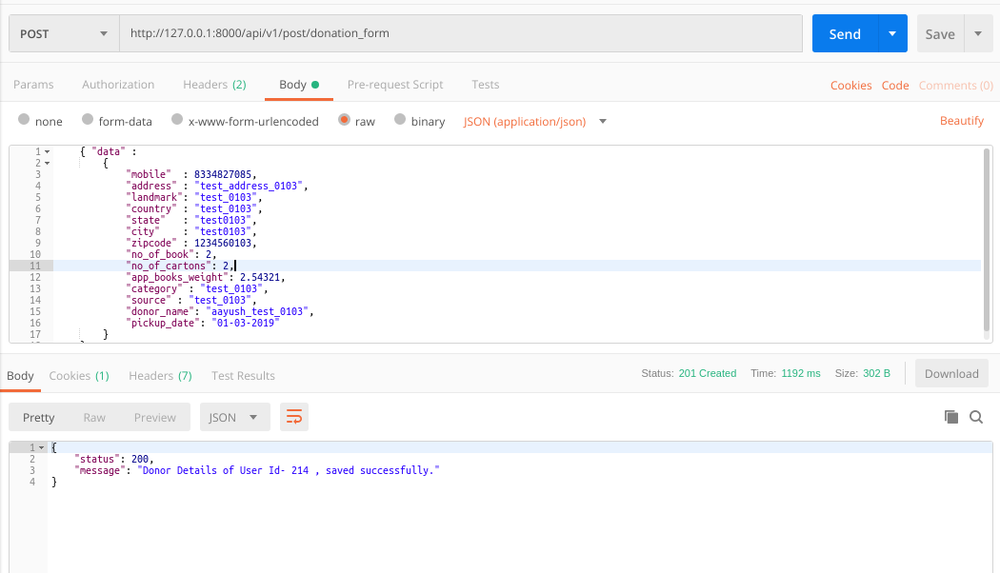
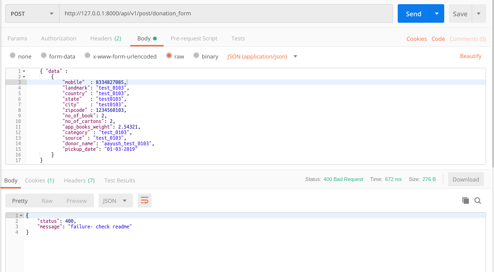
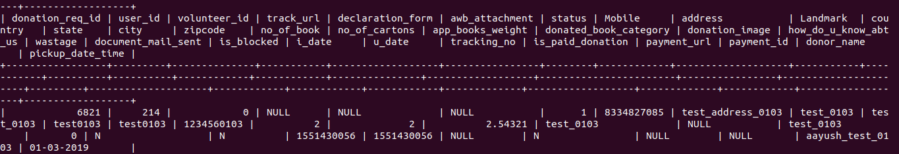

### README- donation_form

#### Description-
- This API inserts donation form details into the *donationreqs* table.
- Data is passed to the API in JSON by frontend application.
- POST Method used.
- Assuming that pincode api is already applied.
- **The API will work only when the User is Logged in as we are passing token in Headers.**

#### API Url-
- http://103.217.220.149:80/api/v1/post/donation_form
- Headers: **KEY**- *Authorization*, **VALUE**- *Token da0a3bed7fd86b67f0cddd7f49248813a14f00f4*
- The token belonged to **mukul.meri@gmail.com** login.

#### Test Data-
	{ "data" :
		{
	        "mobile"  : 8334827085,
	        "address" : "test_address_0103",
	        "landmark": "test_0103",
	        "country" : "test_0103",
	        "state"   : "test0103",
	        "city"    : "test0103",
	        "zipcode" : 1234560103,
	        "no_of_book": 2,
	        "no_of_cartons": 2,
	        "app_books_weight": 2.54321,
	        "category" : "test_0103",
	        "source" : "test_0103",
	        "donor_name": "aayush_test_0103",
	        "pickup_date": "01-03-2019"	
		}
	}    

#### Output-
- Postman Output *(when properly data passed)*

- Postman Output *(when improperly data passed)*

- MySQL Output

#### References-
- *DONATION STATUS :: 
   1- pending, 2- in queue, 3- process, 4- in shipping, 5- dispatched or delivered, 8- not shipping*

#### Improvements-
- **executed the following queries in donationreqs table.**
	- ALTER TABLE donationreqs MODIFY app_books_weight FLOAT;
	- ALTER TABLE donationreqs MODIFY pickup_date_time VARCHAR (255);
- **execute all the queries in MyPustak Live database.** 

#### AUTHOR-
- **coded by AAYUSH GADIA** 
- **contact info: gadia.aayush@gmail.com**
- **written on: 19th Feb' 2019**
- **updated on: 1st March' 2019** (converted it to token based & common models integrated)
