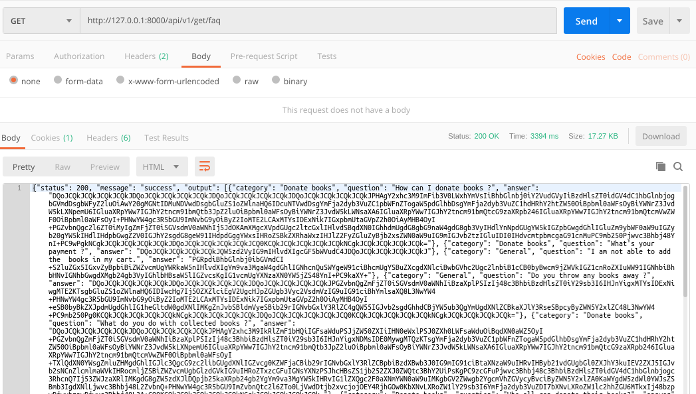

### README- faqs

#### Description-
- This API returns faq category, question & answer in JSON format.
- GET Method used.

#### API Url-
- http://103.217.220.149:80/api/v1/get/faq

#### Test Data-
- No data passed as input.

#### Output-
- Postman Output

#### Improvements-
- decrypt answers in **answer column of faqs table**.

#### AUTHOR-
- **coded by AAYUSH GADIA** 
- **contact info: gadia.aayush@gmail.com**
- **written on: 19th Feb' 2019**
- **updated on: 27th Feb' 2019** (common models integrated)