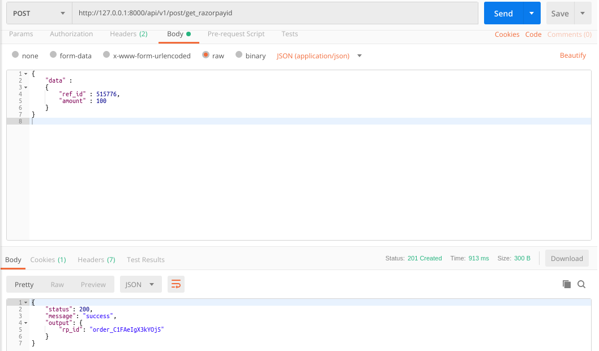

### README- generate_razorpayid

#### Description-
- This API takes **MyPustak's Order Id or Donation Req Id** & the **Amount of transaction** as Input.
- It returns **Razorpay Id** as an Output.
- This **Razorpay Id** is passed to the **Razorpay JS Checkout form.**
- This API uses **Razorpay's Orders API.**
- Data is passed to the API in JSON by frontend application.
- POST Method used.

#### API Url-
- http://103.217.220.149:80/api/v1/post/get_razorpayid

#### Test Data-
	{
	    "data" :
	    {
	        "ref_id" : 515776,
	        "amount" : 100
	    }
	}

#### Output-
- Postman Output

#### Improvements-
- Nothing to make.

#### References-
- https://github.com/razorpay/razorpay-python **(razorpay documentation for python- currently in use :: Feb' 19)**
- https://docs.razorpay.com/docs/checkout-form *(checkout form)*
- https://checkout.razorpay.com/v1/checkout.js *(checkout javascript)*
- **The CSV file of Live RazorPay & Test RazorPay API Credentials** is in app directory.
- Razorpay PG Flowchart-

#### AUTHOR-
- **coded by AAYUSH GADIA** 
- **contact info: gadia.aayush@gmail.com**
- **written on: 19th Feb' 2019**
