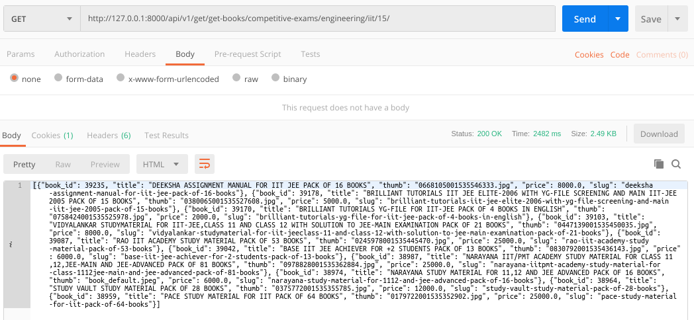
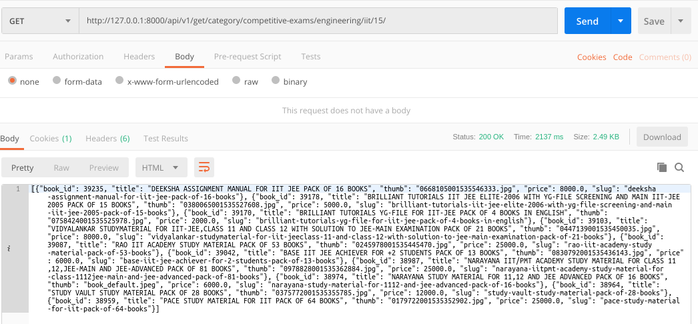
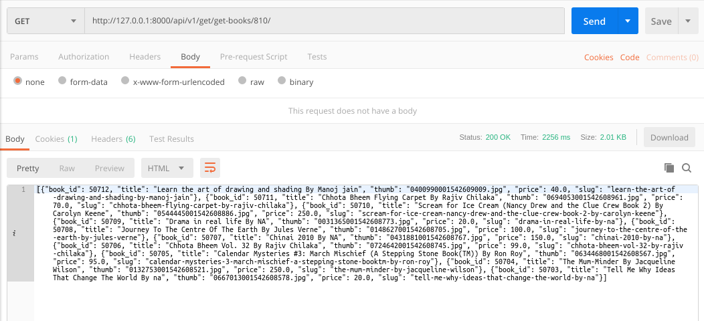
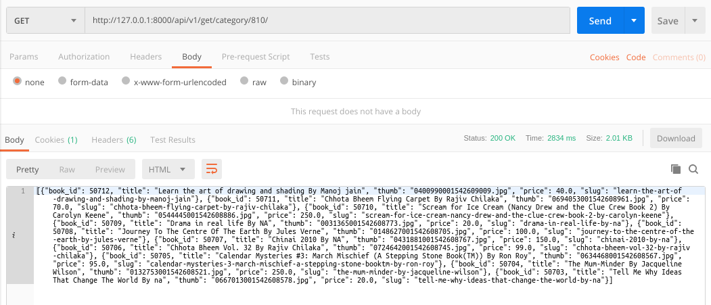
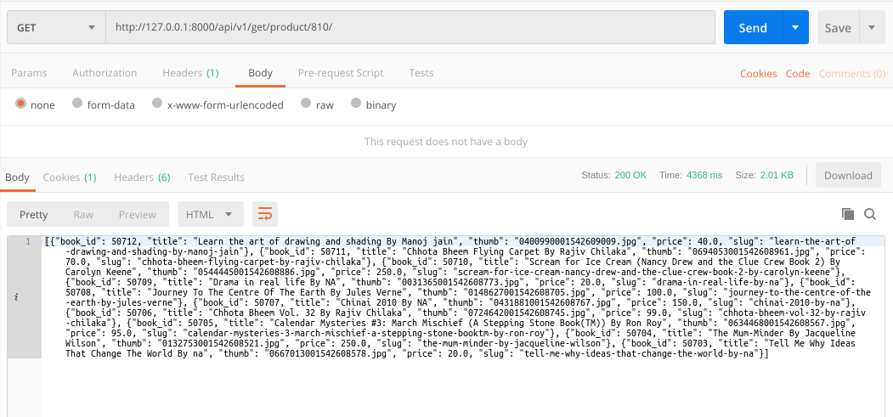

### README- get_books

#### Description-
- Fetches **book_id, title, thumbnail, slug & price of the first 10 products sorted by out_of_stock status & then by upload time.** 
- The **product viz "in stock" & which is uploaded recently is fetched first**.
- The data fetched changes dynamically on changing the page number in url.
- Data is returned in JSON.
- GET Method is used.

#### API Url-
- get-books url:
  http://103.217.220.149:80/api/v1/get/get-books/competitive-exams/engineering/iit/15/

- category url:
  http://103.217.220.149:80/api/v1/get/category/competitive-exams/engineering/iit/15/

- ***Output fetched by both the above Urls are same.***  

- **IMPORTANT**-
	- **All the below urls will fetch the same output.**
	- http://103.217.220.149:80/api/v1/get/get-books/810/
	- http://103.217.220.149:80/api/v1/get/category/810/
	- http://103.217.220.149:80/api/v1/get/product/810/	
	- *All these urls are dynamically changed by changing the page number, each page gives 10 products as output.*

#### Test Data-
- No data to pass

#### Output-
- Postman Output by **get-books**

- Postman Output by **category**

- Postman Output 3 (for get-books, category, product)

#### Improvements-
- Existing logic is not a good practice,
- Make the search for category by **slug instead of category id**.
- **Slugs which are not unique along with their links structure**-
	1.0 *Slug Name- engineering*
	1.1 competitive exams > engineering & medical
	1.2 university books > engineering

	2.0 *Slug Name- medical*
	2.1 competitive exams > engineering & medical > medical
	2.2 university books > medical

	3.0 *Slug Name- others*
    3.1 competitive exams > engineering & medical > others, 
	3.2 competitive exams > government jobs > others,
	3.3 competitive exams > international exams > others,
	3.4 competitive exams > school level > others,
	3.5 fiction-non-fiction/religion-spirituality/others
	3.6 fiction-non-fiction/fiction-non-fiction-others/others
	3.7 school-children-books/children-books/others
	3.8 university-books/engineering/others
	3.9 university-books/medical/others
	3.10 university-books/others
	3.11 university-books/others/others
		 
- **Also deleted non-unique slugs which weren't in use from MySQL 5.7 & MySQL 5.6 Clone database.**
- **Query Applied**- ***DELETE FROM categories WHERE id in (285, 286, 282, 281, 283, 284, 287, 293, 344, 345, 346, 347, 348, 349, 351);***
	

#### AUTHOR-
- **coded by AAYUSH GADIA** 
- **contact info: gadia.aayush@gmail.com**
- **written on: 19th Feb' 2019**
- **updated on: 23rd Feb' 2019** (made url's dynamic by page_no)
- **updated on: 25th Feb' 2019** (added /product url info in readme & limit offset fixed)
- **updated on: 27th Feb' 2019** (common models integrated & book_id fetch enabled)
