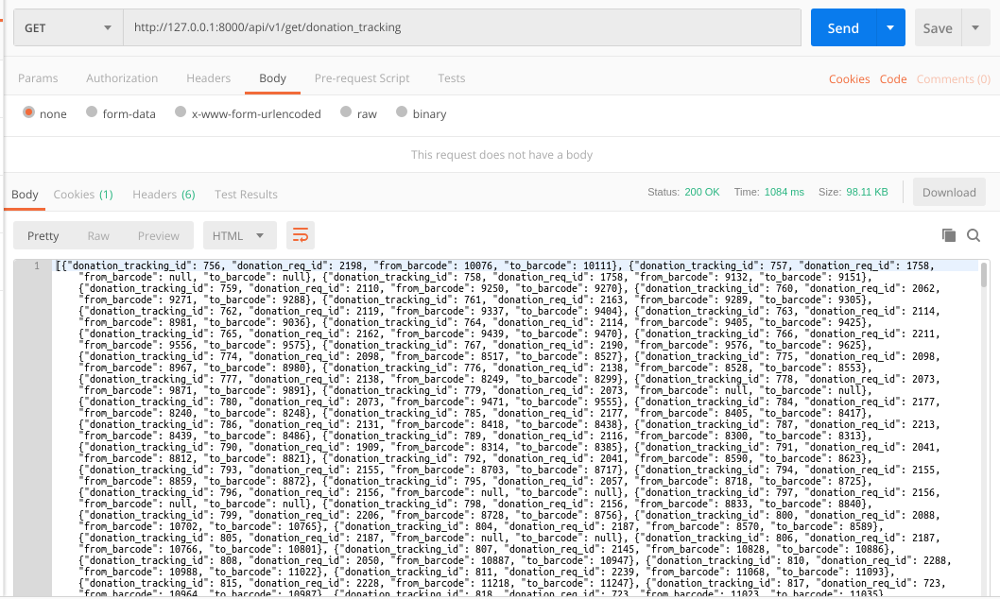

### README- get_donation_tracking

#### Description-
- **Fetches donation_tracking_id, donation_req_id, from_barcode & to_barcode from donation_tracking table.**
- It fetches the **first 1000 entries, sorted by donation_tracking_id in descending order; thereby fetching the ones which are recent & then sorts them in ascending order.**
- Data is returned in JSON.
- GET Method is used.

#### API Url-
- http://103.217.220.149:80/api/v1/get/donation_tracking

#### Test Data-
- No data to pass

#### Output-
- Postman Output

#### References-
- To change the no.of rows returned, **just change the value of limit in sql query passed in views.py.**
- Example : LIMIT 1000 (for 1000 rows), LIMIT 2000 (for 2000 rows)
	

#### AUTHOR-
- **coded by AAYUSH GADIA** 
- **contact info: gadia.aayush@gmail.com**
- **written on: 23rd Feb' 2019**
- **updated on: 27th Feb' 2019** (common models integrated)