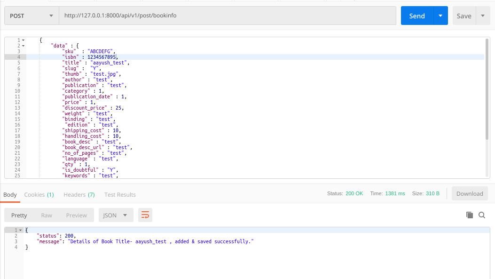
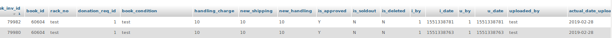

### README- insert_bookinfo

#### Description-
- This API inserts book details into the *books & bookinventory* table.
- If it is a **new book i.e its isbn does not exist** in the *books* table then it insert its data in *books* table.
- But, if it already exists in the *books* table, then it updates the *qty, u_date* & changes *is_out_of_stack* value to **"N"**.
- And in all the situations it adds data to the *bookinventory* table.
- Data is passed to the API in JSON by frontend application.
- POST Method used.

#### API Url-
- http://103.217.220.149:80/api/v1/post/bookinfo

#### Test Data-
	{
		"data" : {
		(O) "sku"  : "ABCDEFG",
		    "isbn" : 9788131514054,
		    "title" : "aayush_test",
		    "slug" :  "Y",
		    "thumb" : "test.jpg",
		    "author" : "test",
		    "publication" : "test",
		    "category" : 1,
		    "publication_date" : 1,
		    "price" : 1,
		(O) "discount_price" : 25, 
		    "weight" : "test",
		    "binding" : "test",
		    "edition" : "test",
		(O) "shipping_cost" : 10,
		(O) "handling_cost" : 10,  
		    "book_desc" : "test",
		    "book_desc_url" : "test",
		    "no_of_pages" : "test",
		    "language" : "test",
		    "qty" : 1,
		    "is_doubtful" : "Y", 
		(O) "keywords" : "test",
	   	    "uploaded_by" : "test",
		    "rack_no" : "test",
		    "donation_req_id" : 1,
		    "book_condition" : "test",
		(O) "handling_charge" : 10,
		(O) "new_shipping" : 10,
		(O) "new_handling" : 10
		}
	}

- *(O) symbolize optional fields. Pl. remove '(O)' from the above before testing in Postman.*

#### Output-
- Postman Output *(when newly adding data)*

- Postman Output *(when adding book which already exists)*

- MySQL Output *(books table)*

- MySQL Output *(bookinventory table)*

#### Improvements-
- **executed the following queries in books table.**
     - ALTER TABLE books ADD handling_cost FLOAT after shipping_cost;
- **Autoincrement of rows not working properly in books & bookinventory table of MySQL 5.7 Clone.** 
  **Tried the following but nothing worked**- 
	 - resetting the counter in each table by ALTER TABLE bookinventory AUTO_INCREMENT = 79950 & ALTER TABLE books AUTO_INCREMENT = 60590;
	 - restting the auto_increment_increment variable to 1 by SET @@auto_increment_increment= 1;
	 - optimizing tables by OPTIMIZE TABLE mp.bookinventory & OPTIMIZE TABLE mp.books;
- **Recreating the table would be the best option.**	 

#### AUTHOR-
- **coded by AAYUSH GADIA** 
- **contact info: gadia.aayush@gmail.com**
- **written on: 28th Feb' 2019**
