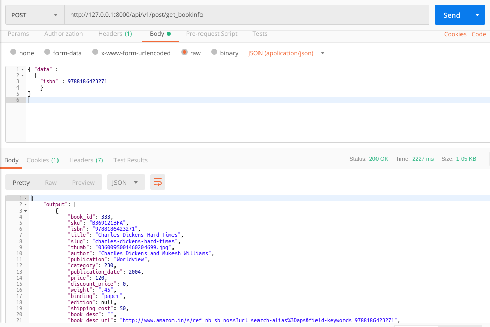
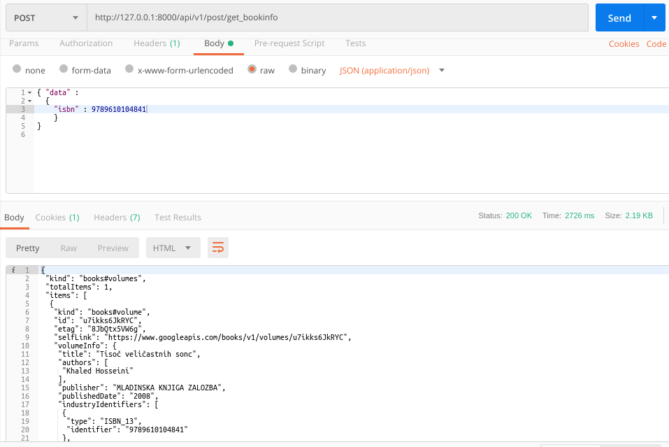

### README- isbn_bookinfo

#### Description-
- This API fetches the book details by isbn.
- It first searches for **mypustak db** for the isbn, if it is not found then it hits the **googlebooks api.**
- Data is passed to the API in JSON by android application.
- POST Method used.

#### API Url-
- http://103.217.220.149:80/api/v1/post/get_bookinfo

#### Test Data-

	{ "data" :
	  {
	  	"isbn" : 9789610104841
	  	}
	}

#### Output-
- Postman Output (by local db)

- Postman Output (by google-api)

#### References-
- **isbn : 9789610104841 (will fetch from google api)**
- **isbn : 9788186423271 (will fetch from mp db)**

#### Improvements-
- Integrate ISBN db API with our API.
- Integrate Amazon Scraped data db with our API.

#### AUTHOR-
- **coded by AAYUSH GADIA** 
- **contact info: gadia.aayush@gmail.com**
- **written on: 19th Feb' 2019**
- **updated on: 27th Feb' 2019** (common models integrated)