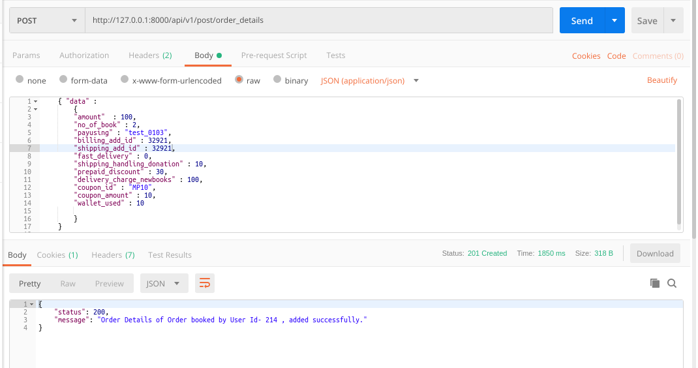
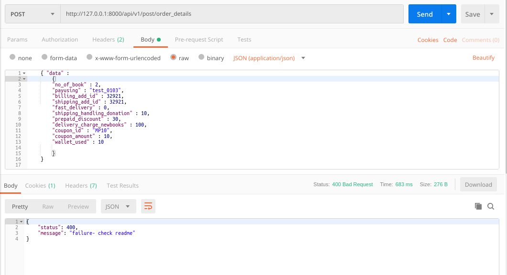
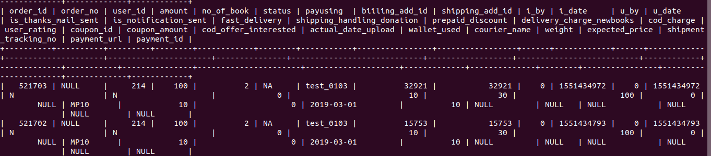
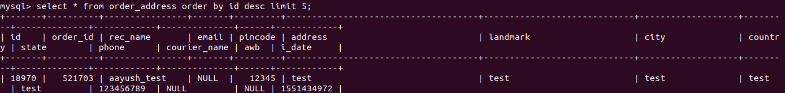

### README- order_details

#### Description-
- This API inserts order details into the *orders* table & also inserts the corr. orders addresses in the *order_address* table.
- Data is passed to the API in JSON by frontend application.
- POST Method used.
- **The API will work only when the User is Logged in as we are passing token in Headers.**

#### API Url-
- http://103.217.220.149:80/api/v1/post/order_details
- Headers: **KEY**- *Authorization*, **VALUE**- *Token da0a3bed7fd86b67f0cddd7f49248813a14f00f4*
- The token belonged to **mukul.meri@gmail.com** login.

#### Test Data-

	{ "data" :
		{
		"amount"  : 100,
		"no_of_book" : 2,
		"payusing" : "test_2502",
		"billing_add_id" : 15753,
		"shipping_add_id" : 15753,
	    (O) "fast_delivery" : 0, 
	    (O) "shipping_handling_donation" : 10, 
	    (O)	"prepaid_discount" : 30, 
	    (O)	"delivery_charge_newbooks" : 100, 
	    (O)	"coupon_id" : "MP10", 
	    (O) "coupon_amount" : 10, 
	    (O)	"wallet_used" : 10 
			
		}
	}  

- *(O) symbolize optional fields. Pl. remove '(O)' from the above before testing in Postman.*

#### Output-
- Postman Output *(when properly data passed)*

- Postman Output *(when improperly data passed)*

- MySQL Output- *orders table*

- MySQL Output- *order_address table*

#### References-
- *ORDER STATUS :: 
   0- processing, 1- complete, 2- cancel, 3- refund, 4- fail, 5- shipping, 6- shippment booked, 7- ready to ship*

#### Improvements-
- **executed the following queries in orders table.**
1. ALTER TABLE orders CHANGE `handling_charge` `shipping_handling_donation` FLOAT; 
2. ALTER TABLE orders ADD delivery_charge_newbooks INTEGER after shipping_handling_donation;
3. ALTER TABLE orders ADD prepaid_discount INTEGER after shipping_handling_donation;
4. ALTER TABLE orders MODIFY coupon_id VARCHAR (255);
5. ALTER TABLE orders MODIFY wallet_used FLOAT;
6. ALTER TABLE orders MODIFY cod_charge FLOAT;
7. ALTER TABLE orders MODIFY coupon_amount FLOAT;
8. ALTER TABLE orders MODIFY actual_date_upload VARCHAR(255);
9. ALTER TABLE orders MODIFY status VARCHAR (255);

- **execute all the queries in MyPustak Live database.**

#### AUTHOR-
- **coded by AAYUSH GADIA** 
- **contact info: gadia.aayush@gmail.com**
- **written on: 25th Feb' 2019**
- **updated on: 1st March' 2019** (converted it to token based & common models integrated)
