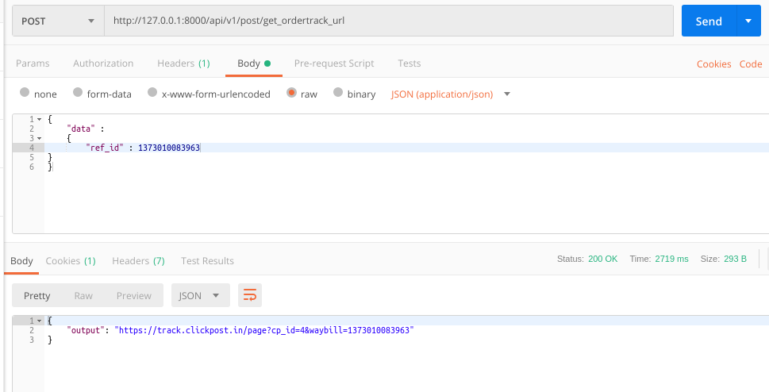
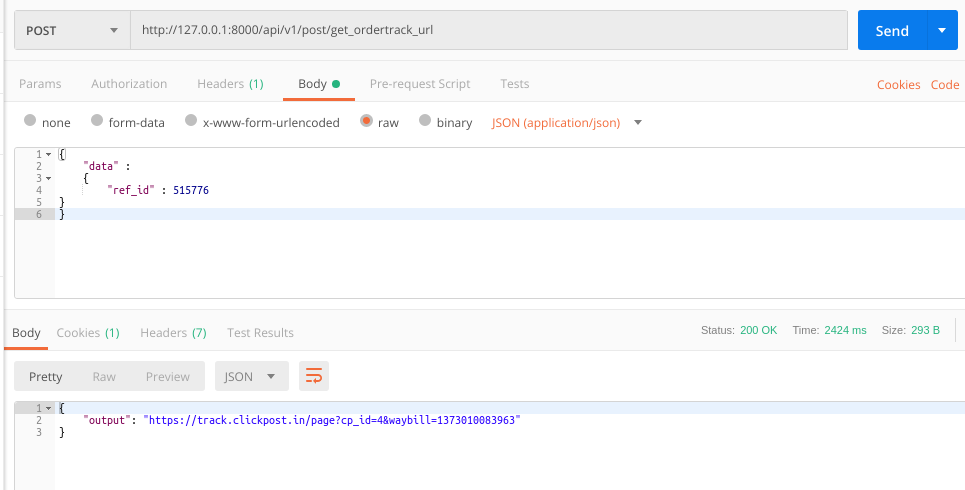

### README- order_track

#### Description-
- This API returns the Clickpost URL for tracking.
- It works for both Order ID as well as AWB No.
- Data is passed to the API in JSON by frontend application.
- POST Method used.

#### API Url-
- http://103.217.220.149:80/api/v1/post/get_ordertrack_url

#### Test Data-
	{
		"data" :
		{
			"ref_id" : 1373010083963
	}
	}     

#### Output-
- Postman Output (by awb no)

- Postman Output (by order no)

#### References-
- **ref_id : 1373010083963 (awb no passed)**
- **ref_id : 515776 (order_id passed)**

#### Improvements-
- **We can integrate the Clickpost JS Widget in our Page. (html present in app directory**- *order_track (integrated clickpost js widget).html* **)**

#### AUTHOR-
- **coded by AAYUSH GADIA** 
- **contact info: gadia.aayush@gmail.com**
- **written on: 19th Feb' 2019**
- **updated on: 27th Feb' 2019** (common models integrated)