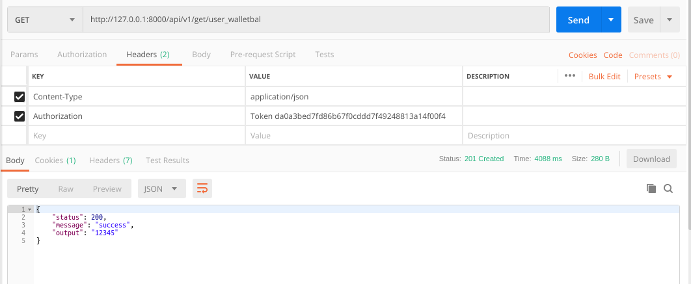

### README- user_mp_wallet

#### Description-
- This API fetches the wallet balance of a user.
- GET Method used.
- Fetched by passing token to the API in headers.
- **The API will work only when the User is Logged in as we are passing token in Headers.**

#### API Url-
- http://103.217.220.149:80/api/v1/get/user_walletbal
- Headers: **KEY**- *Authorization*, **VALUE**- *Token da0a3bed7fd86b67f0cddd7f49248813a14f00f4*
- The token belonged to **mukul.meri@gmail.com** login.

#### Test Data-
- No data to pass

#### Output-
- Postman Output

#### AUTHOR-
- **coded by AAYUSH GADIA** 
- **contact info: gadia.aayush@gmail.com**
- **written on: 23rd Feb' 2019**
- **updated on: 26th Feb' 2019** (converted it to token based)
- **updated on: 27th Feb' 2019** (common models integrated & url changed)
